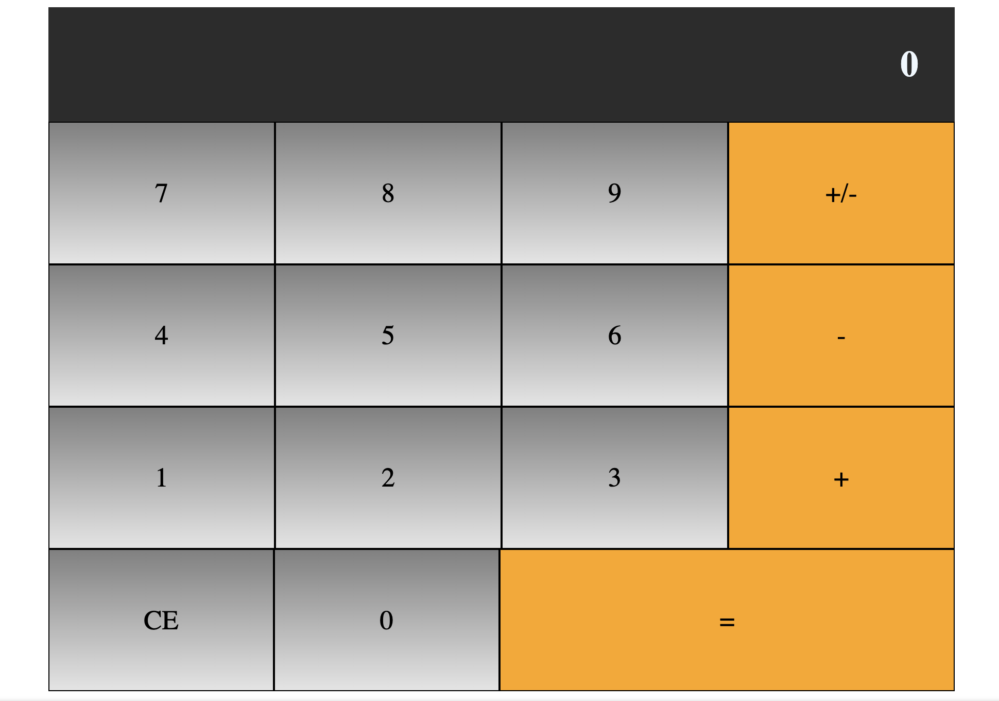

## Soal MID

<h2>Aturan MID</h2>
<ol>
  <li>Silahkan buat repository masing-masing, dengan format NIM_NAMA</li>
  <li>File yang dikumpulkan berupa File html, css, dan js</li>
  <li>File bisa di gabung jadi 1 code</li>
  <li>Tambahkan file readme.md untuk menampilkan output</li>
</ol>

